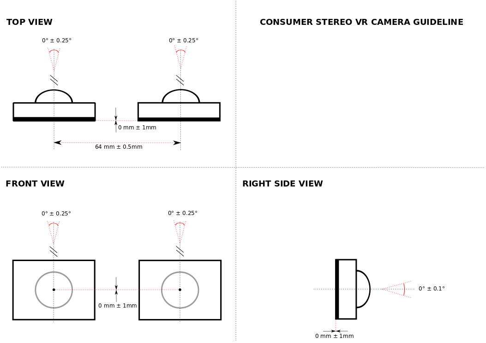

# VR180 Camera Hardware Guideline

[TOC]

## Introduction

--------------------------------------------------------------------------------

Imagine being able to capture your life's important moments in VR -- birthdays,
weddings, vacations -- and being able to step back into those memories as if you
were there. VR180 is a new category of consumer VR cameras that **captures the
world how you actually see it**--with two wide-angle cameras where your eyes
are. This camera design provides both stereo and immersion--yielding the best VR
capture and playback experience that's currently possible in a portable,
consumer grade camera.

You view the latest VR180 videos
[here](https://www.youtube.com/playlist?list=PLU8wpH_Lfhmu_kk955BFwvV0yT0PEcenA).

Why is Google providing a guideline for a VR camera? We want VR to succeed and
we believe that VR video is one of the most important uses cases for this
medium. We also want to make YouTube one of the best ways to share VR video with
friends, family, and the world. Making this capture, sharing, and viewing
experience successful on YouTube, we strongly recommend that every piece conform
to the guideline: the cameras must satisfy certain constraints (e.g., IPD, field
of view), and they must output content that YouTube can ingest and recognize.
This document describes these camera and format constraints for the benefit of
VR180 camera manufacturers.

This document provides design and manufacture recommendations as well as
explanations of why these recommendations are important.

In addition to these hardware recommendations, Google will also supply: A file
format specification for ingest to YouTube and playback on Daydream An iOS &
Android camera & footage management app built specifically for VR180 cameras.

## System Layout

--------------------------------------------------------------------------------

#### Recommendation

*   Distance of 64 mm between optical axes.
*   Imaging planes aligned and in the same plane.

The reason for this geometry is to emulate the human vision system in order to
capture realistic content. As such, the mean human interpupillary distance (IPD)
in the US is 63.5 mm1, while in Europe is 1 mm smaller2. A
larger IPD makes things feel smaller than reality and hurts immersion and
presence when viewed through a VR HMD. In our experimentation other improvements
like better lenses or larger pixels are not worth it if they can only be
achieved by increasing IPD.

Figure 1. Layout recommendation and tolerances.

### Calibration

#### Recommendation

*   Factory calibration

The main requirement in terms of calibration and manufacturing tolerances is
that users should be able to fuse the content comfortably when watching it in a
VR headset. Previous studies have shown humans notice as little as 0.5° of
vertical parallax3, i.e. misalignments between the left / right
images that make it hard to fuse. Setting 0.5° as the maximum vertical parallax
leads to limits in how accurate the position and orientation of the two cameras
have to be known in order to correctly fuse the content.

## Camera Module

--------------------------------------------------------------------------------

### Lens Projection and Field of View

#### Recommendation

*   Minimum: 100°+ vertical and 130°+ horizontal
*   Maximum: 180° vertical and 180° horizontal
*   Recommended: 140 vertical and >140 horizontal

The lens projection shall be primarily y=fΘ (i.e. equidistant).

The minimum field of view is constrained by the following requirement: the
content should be completely immersive in a modern headset, i.e. the user should
be able to watch the content in a VR headset **without** seeing the boundaries
of the video. Typical field of view of VR headsets is currently ~100°.

Beyond the minimum requirement, the user should be able to slightly rotate the
headset left/right and up/down while not seeing the boundaries of the content.
The left/right wiggle room is typically larger than the up/down due to how the
neck works.

Note that a very large field of view is also not recommended. The geometry of
the stereo camera is such that, when playing the content, the viewer introduces
vertical parallax as the user moves its head left/right w.r.t. the viewing
direction of the cameras. So the larger the horizontal fov, the more vertical
parallax we will see for close objects as we look at the sides of the video.

### Focusing

#### Recommendation

*   Fixed at hyperfocal

The two camera modules should have a fixed focus, ideally at hyperfocal
distance4. This setting has worked well in all the experimental
content and keeps the logic simple. Autofocus is confusing and jarring during
playback and would need to be synchronized which adds cost and complexity.

### Automatic White Balance, Automatic Exposure and ISO

#### Recommendation

*   Synchronized in both cameras

The human brain can accommodate variations of color temperature or exposure
between the two eyes. However, keeping both camera modules synchronized will
help avoid “sparkling” stereo effects where the brain can detect the variation.

### Sensor Synchronization

#### Recommendation

*   Line sync

Differences in synchronization between the two camera modules will lead to
artifacts when the scene contains motion. Experimental validation shows 1-frame
error may be acceptable for slow motion content, but line sync is recommended
for common and fast motion scenes.

### Pixel Size and Aperture

#### Recommendation

*   Acceptable: 1.2 µm+, eg. IMX386, F/2.2
*   Ideal: 1.55 µm+, e.g. IMX477, F/2.2

Use cases include a lot of content captured indoors. A large pixel size will
help increase the low-light performance.

### Image Sensor Resolution

#### Recommendation

*   At least 8MP (need to support 1440p)

Current VR headsets have a typical angular resolution of 15 pixels per degree,
and this number is going to increase pretty rapidly in the next few years. The
camera should resolve at least the same angular resolution, which for ~100
degrees vertical fov is ~1440p per eye.

### Frame Rate

#### Recommendation

*   Acceptable: 30 fps
*   Ideal: 60 fps

High frame rate is important for VR Video. VR screen update ranges from 60 fps
to 120 fps and 30 fps prevents motion from looking good in an HMD.

## Inertial Measurement Unit

--------------------------------------------------------------------------------

#### Recommendation

*   BMI160 (6-axis) 1000Hz
*   Always-on on-device sensor-fusion
*   Sub-frame sync between camera modules and IMU
*   IMU / camera module alignment < 0.25°

A high-quality IMU is recommended to allow for motion stabilization, which is
necessary for hand-held capture; lack of IMU+stabilization limits usage to
tripod-only. This is particularly crucial for VR applications to reduce motion
induced sickness.

The IMU data required for motion stabilization should be captured by the device
during capture, but it should not be applied to the pixels, it should be added
to the file as metadata (format TBD). Motion stabilization should be performed
at playback time by rotating each video frame according to the sensor-fused 3d
orientation captured by the IMU. This would result in objects far away always
being shown at the same location in the world, despite handshake or camera
motion.

For best results, the device should perform sensor fusion continuously, even in
standby-mode. Without it, the IMU data for short videos could be not good enough
when it is later used by the player. Even if sensor fusion algorithms were used
on the player side, short videos would not contain enough IMU data to correctly
initialize them.

Thus, the recommendation is that the IMU data embedded in the file should be
good enough for “dumb” video players to apply the motion stabilization without
additional IMU data processing.

The relative rotation between the IMU and the camera modules needs to be known,
so the IMU rotation can be correctly converted from the IMU coordinate system to
the camera coordinate system. The tolerance for the estimation of this rotation
is 0.25°.

--------------------------------------------------------------------------------

1 https://en.wikipedia.org/wiki/Interpupillary_distance

2 https://en.wikipedia.org/wiki/Pupillary_distance

3 Measurement for the panum’s fusional area in retinal fovea using a
three-dimensional display device. QIN, D., TAKAMATSU, M., AND NAKASHIMA, Y.
2004, Journal of Light & Visual Environment.

4 https://en.wikipedia.org/wiki/Hyperfocal_distance
